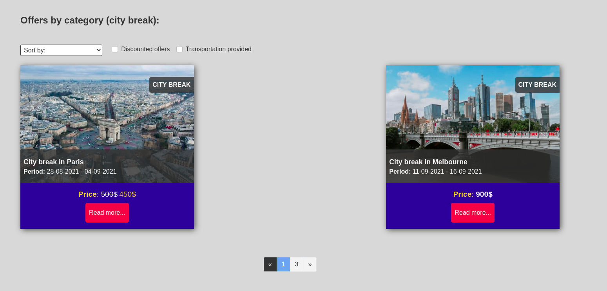

# Tourism website

<h3> !!! This is the front end application. You can find the back-end on <a href="https://github.com/Ssmartcode/Tourismwebsite-backend">this repository</a> </h3>
<h3 > !!! Also there is an old repository of same application <a href="https://github.com/Ssmartcode/TourismWebsite">here</a> </h3>

## Website Presentation

The purpose of this web app is to allow tourism agencies to create their own offers and share them to other users. Any organizer has access to 
a dashboard where he can create, update and delete offers. Also he can manage messages recieved from users that navigates the website. 
To send a message, and add offers to favorites you need to create an accout that has the role of a user. The user can choose the role when creating an accout!

After registering an account you have access to your dashboar (different from one user role to the other)

**Admin Dashboard**

 

**User Dashboard**

 

**Creating an offer**
 
To create and offer you need to navigate in the dashboard shown above
 

**Searching for an offer**

 

**Displaying an offer**

 

**Seraching for offers with filters**

